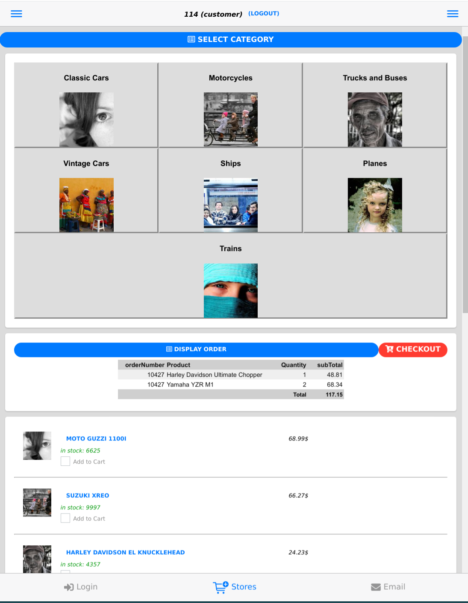
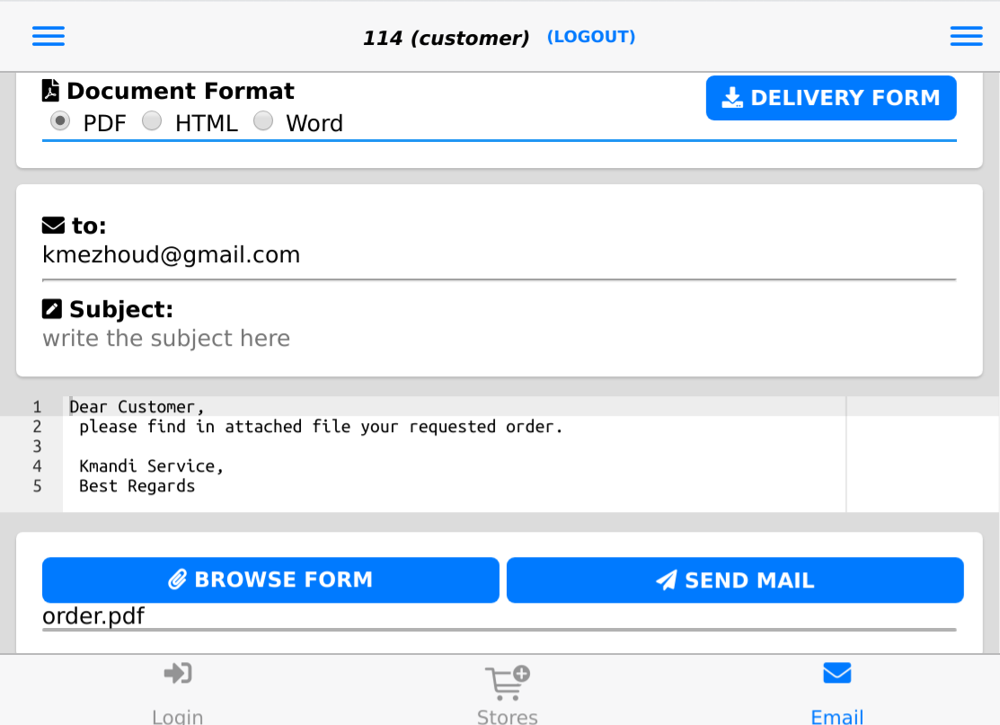

`Mobi100c` is a web/mobile app with multiple login profiles.    
The Customer login can browse items by categories, and order selected articles. The app displays the orders history and corresponding status (pending, shipping, or shipped). 
The office login displays in editable table the list of sold items and its information including available stock. 
The office can add easily update stock, add, or remove items.
The app is build to connect to SQLite, MySQL and MMSQL databases.

## Browse the Store with Customer login

Steps to follow:

* Select Categories
* Scroll items and check ones for ordering
* Specify the quantity of items
* Display the Total of the order
* Checkout and Confirm order.

## Stock management with office login

Steps to follow:

* Select row from table to edit/copy/delete or add new one
* Confirm order and send to customers

## Send email to inform Customer/office

Steps to follow:

* build purchase order in wanted format (pdf, docx, html)
* fill email address, Subject, and the body text of the email
* attach document
* Send email

